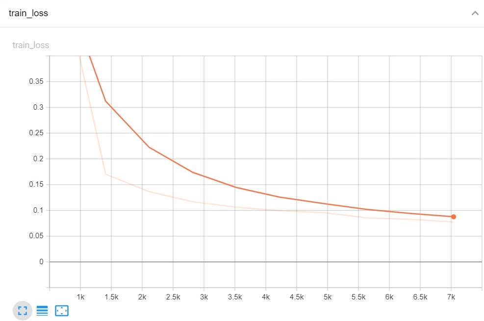
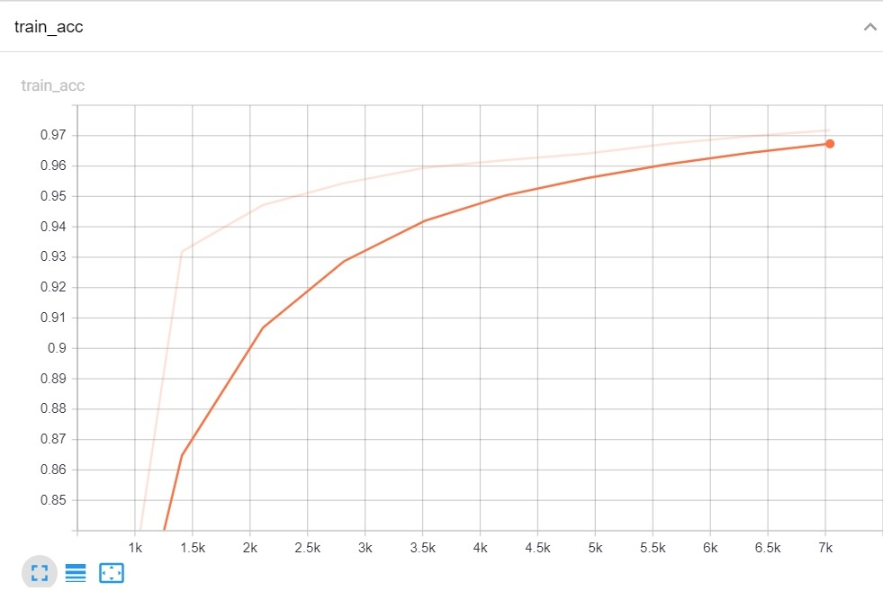
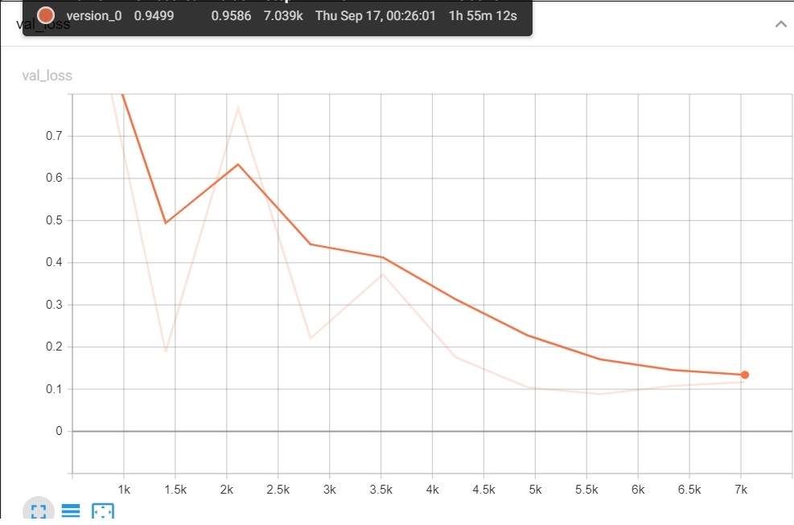
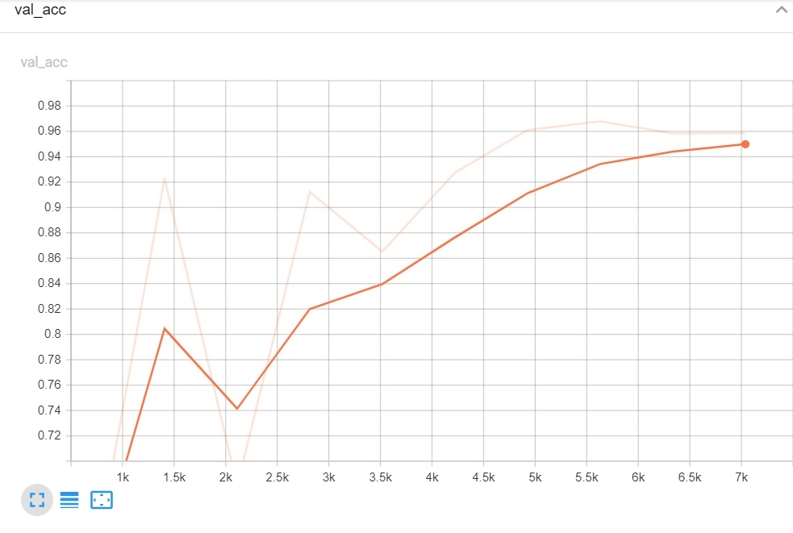
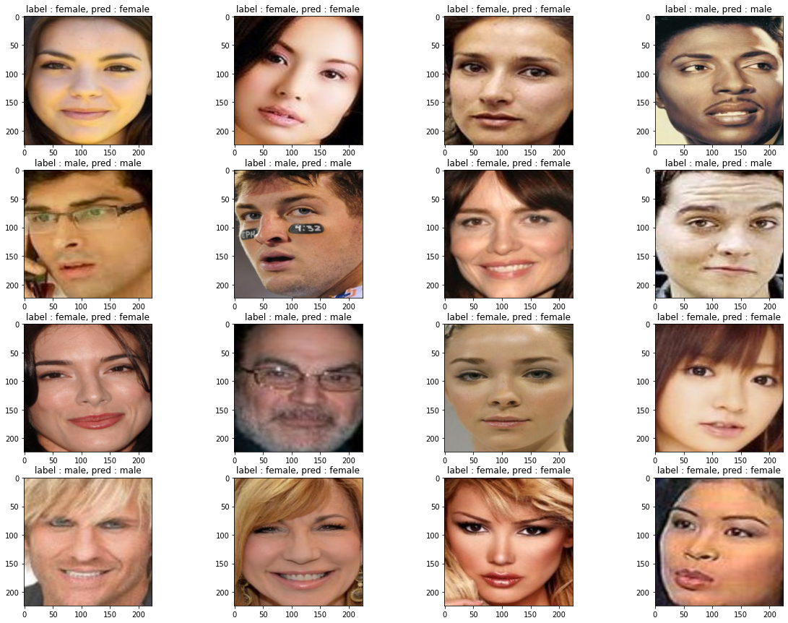

# NtechLab_CV_Task

**Описание задачи** : Необходимо обучить нейросеть, способную по входному изображению лица определять пол человека на изображении.

**Датасет** выглядел следующим образом:

Данные были разделены на две папки - **тренировочную** и **тестовую**. Тестовая часть составляла 10 % от исходных данных

В данной задаче была обучена нейросеть **ResNet18**. Обучение проводилось при помощи библиотеки **Pytorch Lightning**. Обучение длилось 10 эпох (2 часа на gpu).

В результате были получены следующие графики лосс функций и метрик:

Тренировочная лосс функция

Тренировочная метрика

Тестовая лосс функция

Тестовая метрика

Данные графики можно посмотреть при помощи tensorboard командой %tensorboard --logdir lightning_logs (скопируйте папку lightning_logs)

После каждой эпохи я проводил валидацию и сохранял модель. Далее **в конце обучения выбиралась лучшая из сохраненных моделей с самым низким показателем тестовой лосс функции.**(Все делалось автоматически)

## В итоге самые лучшие показатели были на 7 эпохе с тестовым accuracy 0.97

Результат предсказания модели на тестовых данных:

## Для использования файла process.py поместите в одну директорию с ним файл https://drive.google.com/file/d/1-AYqIzIJKUOMBk_0IVrkXHQ_fujebpWc/view?usp=sharing

## Для запуска процесса тренировки нейросети:  
1) Запустите notebook файл на google colab c gpu
2) Добавьте на ваш гугл диск исходный сжатый датасет и измените строчки распаковки архива, а также переменную data_dir(путь к датасету)
3) Измените переменнную checkpoint_path (директория где будет сохраняться модель после каждого цикла обучения)
4) Измените переменную save_path (находится в самом конце кода) на директорию куда пойдет конечная обученная модель.
