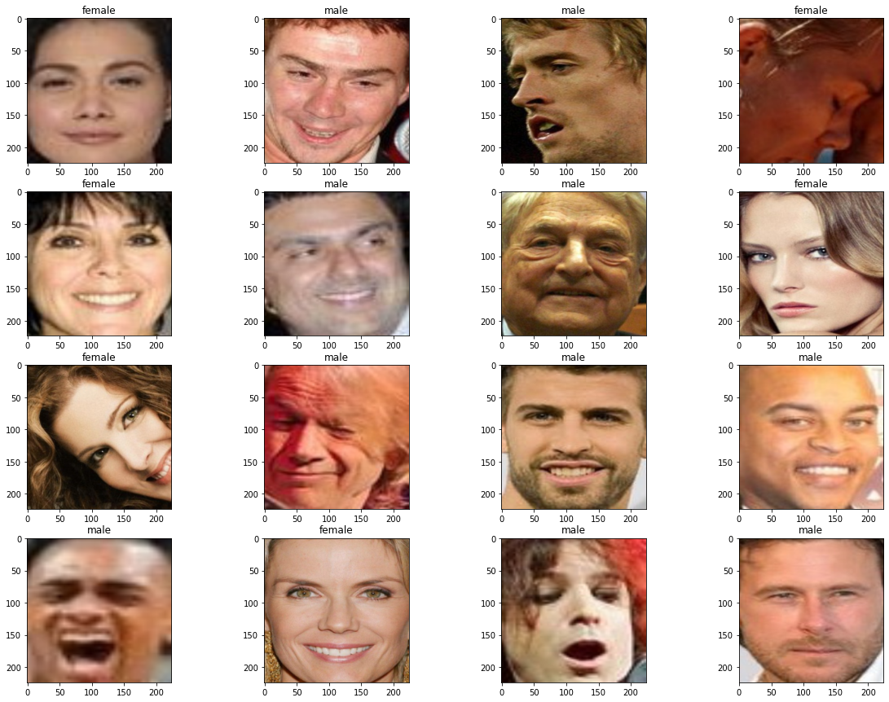

# NtechLab_CV_Task

**Описание задачи** : Необходимо обучить нейросеть, способную по входному изображению лица определять пол человека на изображении.

**Датасет** выглядел следующим образом:

Данные были разделены на две папки - **тренировочную** и **тестовую**. Тестовая часть составляла 10 % от исходных данных

В данной задаче была обучена нейросеть **ResNet18**. Обучение проводилось при помощи библиотеки **Pytorch Lightning**.

В результате были получены следующие графики лосс функций и метрик:

Тренировочная лосс функция

Тренировочная метрика

Тестовая лосс функция

Тестовая метрика

Данные графики можно посмотреть при помощи tensorboard командой %tensorboard --logdir lightning_logs (скопируйте папку lightning_logs)
